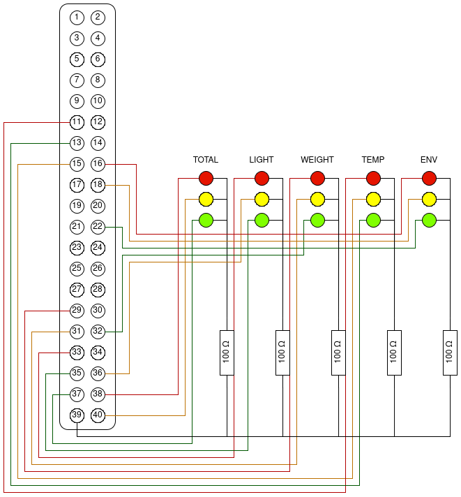
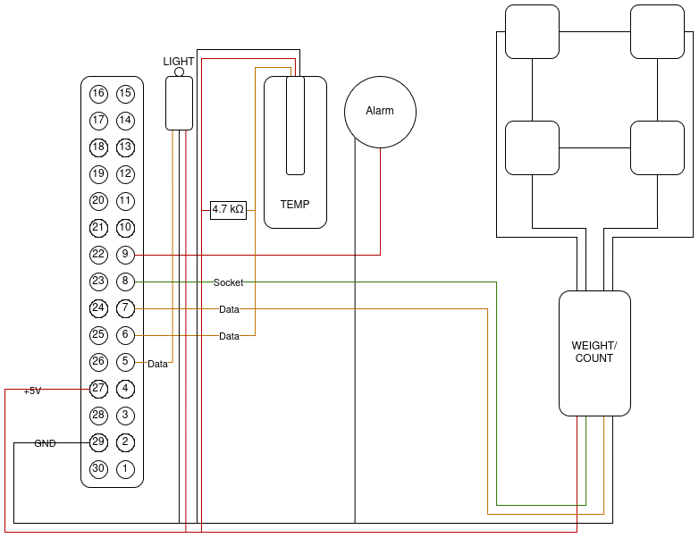

# BierAmpel

[](https://github.com/Mega-Cookie/BierAmpel/actions/workflows/build.yml)

Dokumentation der Projekarbeit im Lernfeld 7 der Gruppe 3

## Gruppemitglieder
- Ahmed
- Ben
- Kevin
- Lucas
- Michael
- Zenon

## Wir brauchen:
1. Eine Kühlbox 
    - Müsste ich noch haben.

1. Drucksensoren (HX711) am Boden 
    - Ist genug Bier da?
    - Sind mit Halterungen aus dem 3D-Drucker ein einem Brett befestigt.
        - [Printables](https://www.printables.com/model/157473-load-cell-holder)
    - [Amazon](https://www.amazon.de/Menschlichen-Gewichtungssensor-Verst%C3%A4rker-Dehnungsmessger%C3%A4t-Badezimmerwaage/dp/B07FMN1DBN)

1. Temparatursensor (ENOPYO 1M) in der Kühlbox 
    - Ist das Bier kalt
    - Ist in einer kleinen Glasflasche mit Wasser um Temperatur einer Flüsigkeit in der Kühlbox zu messen.
    - [Amazon](https://www.amazon.de/Temperatursensor-ENOPYO-Wasserdichte-Temperaturf%C3%BChler-Temperaturkabel/dp/B0DPKHDMHH)

1. Helligkeitssensor (DollaTek 3Pcs Digitales Licht Intensitätssensormodul) in der Kühlbox 
    - Ist die Box offen?
    - Empfindilichkeit kann über Drehregler eingestellt werden.
    - [Amazon](https://www.amazon.de/DollaTek-Digitales-Intensit%C3%A4tssensormodul-Fotowiderstand-Photowiderstand/dp/B07DJ4WQV5)

1. Eine kleine Ampel aus LEDs 
    - Ist Bier zum Trinken Bereit?
    - LEDs in den nötigen Farben habe ich.
    - Eine Ampel je Sensor + eine Ampel für den schlechtesten Wert.
    - Gehäuse kann ich drucken.
        - [Printables](https://www.printables.com/model/420231-traffic-light-for-arduino-ampel-fur-arduino)

1. Alarm Buzzer 
    - Ist die Box zu Lange offen?
    - Geht nach 30 Sekunden los wenn der Deckel auf ist.
    - Buzzer habe ich. 
        - Alternativ Lautsprecher am RPi spielt einen Alarmton ab.


## Umsetzung
* Die Umgebungstemperatur holen vom MQTT Broker von Herrn Mierwald.
* Die Sensoren sind an einen Arduino angeschlossen.
* Die Daten wernden über das USB-Kabel (Serial) an den RaspberryPi geschickt.
* Aus den Sensoren kann die Temperatur und der Menge an Bier (Gewicht/Gewicht einer Bierdose) ermittelt werden.
* RaspberryPi gesammelt die Daten und steuert über ein Python Script die Ampeln.
* Im selben Script werden die Daten and den MQTT Broker gesendet.

## Kosten
| Posten         |     Summe |
|:---------------|----------:|
|Gewichtssensor  |      7,89€|
|Temperatursensor|      4,99€|
|Lichtsensor     |      4,99€|
|**Gesamt**      | **17,96€**|

Kosten für Kleinteile wie Kabel, LEDs, und PLA, sowie den Arduino werden vernachlässigt, da diese sowieso vorhanden sind.

## Nutzung

```
./BierAmpel-arm64rpi5   --boker <MQTT broker adress> \ [localhost]
                        --port <MQTT broker port> \ [1883]
                        --user <MQTT user> \
                        --pass <MQTT password> \
                        --serial <serial port> \ [/dev/ttyACM0]
                        --env <ambient temp MQTT topic> [env/temp]
```

\<value\>

[default]

## Schaltkreis
### LEDs

### Sensoren
